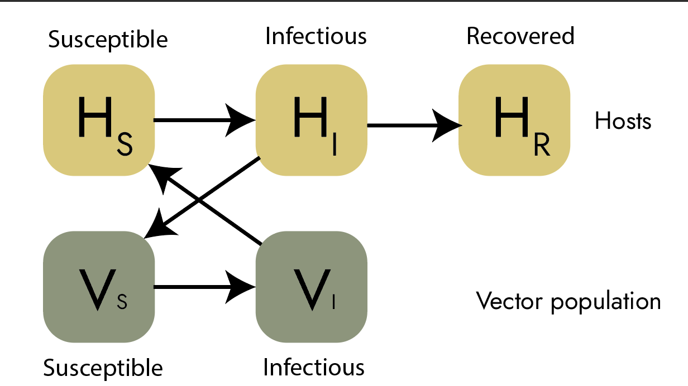

library(ggplot2) library(igraph)

## Dispersal on a network (simplest) (June 5, 2024)

For the simplest step, we can create an adjacency matrix and multiplying it by the vector containing the population number, we can project it forward. I did this without using Igraph just to get a gist of what adjency matrices are and the matrix operators.

```{r}
### A B C D
### B
### C
### D
matrix_adjacency <- matrix(c(0,0,0,1,
                           1,0,1,0,
                           0,1,0,1,
                           1,0,1,0), nrow = 4, ncol =4, byrow = TRUE)
matrix_adjacency <- matrix_adjacency/2
```

```{r}
Number_vec_0 <- c(20,50,20,10)

function_dispersal <- function(original_vec, adjacency_matrix, time_step){
        
        time_step_model <- NULL
        
        initial_vec <- original_vec
        
        
        for (i in seq(1, time_step)){
         initial_vec = initial_vec %*% adjacency_matrix
        
        time_step_model[[i]] <- cbind.data.frame(initial_vec,time= i)
        }
        full_model <- do.call(rbind,time_step_model)
        colnames(full_model) <- c("A", "B", "C", "D", "time")
        return(full_model)
}

full_model_timestep <- function_dispersal(Number_vec_0 ,matrix_adjacency, 30 )
print(full_model_timestep)
```

## A simple SIR model

If I want to calculate the R0 at each node, then I must be able to simulate an infection at each time point. For my model, I am thinking that the figure looks like this:



$$
$$$$\frac{dH_S}{dt} = \wedge - \beta H_S V_I - \mu H_S
$$

$$
$$$$\frac{dH_I}{dt} = \beta H_S V_I - \gamma H_I - \mu H_I
$$

$$
$$$$\frac{dH_R}{dt} = \gamma H_I - \mu H_R$$

$$
$$$$\frac{dV_S}{dt} =\Delta - bH_IV_S - \mu_V V_S$$

$$
$$$$\frac{dV_I}{dt} = bH_IV_S - \delta V_I - \mu_V V_I$$


Here, the human hosts ($H$) are being infected by infected vectors ($V$). We assume that the host population and vector population are constant in the absence of interventions ($H_S + H_I + H_R = N$). The $\wedge$ then indicates that 
